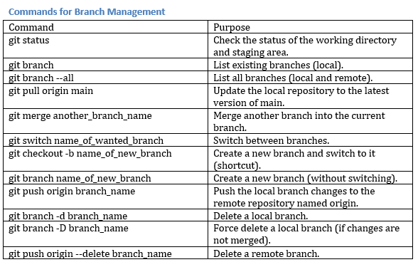

# A Beginner's Guide to Working with Git Repos in VSCode

## 🖇️ Cloning the Repository 🖇️

a) We can open VSCode, and on the main page, click on
**"Clone Git Repository"**.\
b) **Alternatively**, we can **open the terminal** and run the following command
for our Repo:\
`git clone https://github.com/MIT-Emerging-Talent/ET6-foundations-group-05.git`

______________________________________________________________________

## 🌿 Branch Creation and Commands for Branch Management 🌿

> **🗒️Note: A Table for Frequently Used Commands**  
> 

- To avoid risking the main branch, we will work on separate branches.

> **🗒️Note: Branch Naming Tips**\
> We need to use meaningful names related to our task.\
> _Example: Collaboration_Learning_Goals_

### a) Check status of our working directory and staging area

`git status`

- This command shows:
  - Which branch we're on
  - Changes not staged for commit
  - Changes staged for commit
  - Untracked files

### b) Check existing branches (local)

`git branch`

### c) Check all branches (local and remote)

`git branch --all`

### d) Update our local repository to the latest version of main

`git pull origin main`

### e) Merge another branch into your current branch

`git merge another_branch_name`

> _Example: While on our working branch, to merge main into it: `git merge main`_

### f) To switch between branches

`git switch name_of_wanted_branch`

### g) Create a new branch and switch to it

- We can do it in one command with this command: `git checkout -b name_of_new_branch`
- Or, in separate steps:
  - Create a new branch: `git branch name_of_new_branch`
  - Switch to the new branch: `git switch name_of_new_branch`

> **🗒️Note:** Both creation options are valid.

### h) Pushing our changes to remote

`git push origin branch_name`

### i) Delete branches

- Delete a local branch: `git branch -d branch_name`
- Force delete a local branch (if changes are not merged): `git branch -D branch_name`
- Delete a remote branch: `git push origin --delete branch_name`

> **❗🗒️IMPORTANT NOTE: Updating our local repo regularly is very important
> in order to avoid large conflicts.**
>
> - We can follow these commands with this order to keep our local branch up to date:
>
> 1️⃣ `git switch main`
>
> 2️⃣ `git pull origin main`
>
> 3️⃣ `git switch our_branch`
>
> 4️⃣ `git merge main`
>
> - If we get conflicts, we can resolve them following the steps in
>   **"Handling Merge Conflicts"** section down below.

______________________________________________________________________

## 🚀 Making and Pushing Changes to GitHub 🚀

### 1. Staging Changes

- **❗Avoid** using `git add .`

  - Because, using it stages all changes in the repository, which can unintentionally
    include unrelated files or changes and cause conflicts.

- **Preferred Alternative:** Add specific files only with: `git add folder_name/file_name`

> _Example: git add solutions/solution.py_

### 2. Committing Changes

- After staging, commit your changes with a descriptive message:
  `git commit -m "Descriptive message, e.g., Added solution and tests for challenge_name"`

> **🗒️Note:** The quotes are required for the message.

### 3. Pushing to GitHub

- Push your branch to GitHub: `git push origin branch_name`

> **❗🗒️Important Note:** In our particular repository, direct pushes to the
> main branch are blocked. So, `git push origin main` **will not** work.
> To merge changes into the main branch, we will create a Pull Request (PR)
> after pushing our branch.

______________________________________________________________________

## 🔄 Pull Requests and Reviews 🔄

### 1. Creating a Pull Request (PR)

> **🗒️Note:** Before creating a Pull Request,\
> we need to ensure all work is
> completed on our branch, and commit and push all changes to GitHub.

a) If our branch is **recently pushed**, GitHub will display a **Compare & Pull Request**
button.

- We can click it to start creating a PR.

b) Alternatively, we will:

- Go to the Pull Requests tab on the GitHub repository.
- Click New Pull Request.
- Select the branch and the branch to merge into (e.g., main).
- Click Create Pull Request.

### 2. Reviewing a Pull Request

If we are reviewing someone else's pull request. We will:

- Go to the **Pull Requests** tab in the repository.
- Click the pull request to review.
- Review the changes and leave comments if necessary.
- Approve or request changes.

> **🗒️Note: Tips for Reviewing**\
> We need to check if the branch meets all quality standards.\
> We will ensure the code is clear, functional, and tested.

______________________________________________________________________

## 🔗 Merging 🔗

Once the PR is approved, we need to click the green **"Merge pull request"** button
and then **"Confirm merge"**. After successful merge, our changes will be added to
the main branch.\
🎉 And, congratulations! Once the PR is merged, our solution is part of the repository.

> **🗒️Note:** If we see a **"Merge conflicts"** message instead of the merge button,
> we'll need to resolve conflicts first. 😓 We can follow the steps in
> **"Handling Merge Conflicts"** section below, or contact our team lead or
> experienced team member for assistance.

### Handling Merge Conflicts

If we get conflicts while merging main into our branch:

1. Get Latest Changes from Main: `git switch main` and then, `git pull origin main`
1. Switch Back to Our Branch: `git switch our_branch`
1. Merge Main into Our Branch: `git merge main`

- At this point, we might encounter conflicts.(GOD FORBID🥲) And Git will indicate
  which files have conflicts that need to be resolved.
- **To resolve conflicts:** We open the conflicted files in VSCode and look for
  conflict markers (like \<<\<<\<<\<, =======, and >>>>>>>). We need to edit the
  files manually to resolve the conflicts and keep the desired changes.
- **To mark resolved files:** Once we've resolved the conflicts in each file, we
  need to add those files to the staging area: `git add resolved_file`
- Finally, **to commit the merge with a message:**
  `git commit -m "Merge main and resolve conflicts"`
